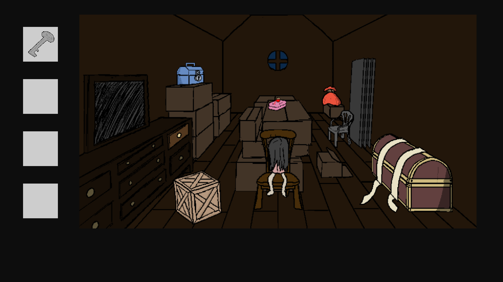
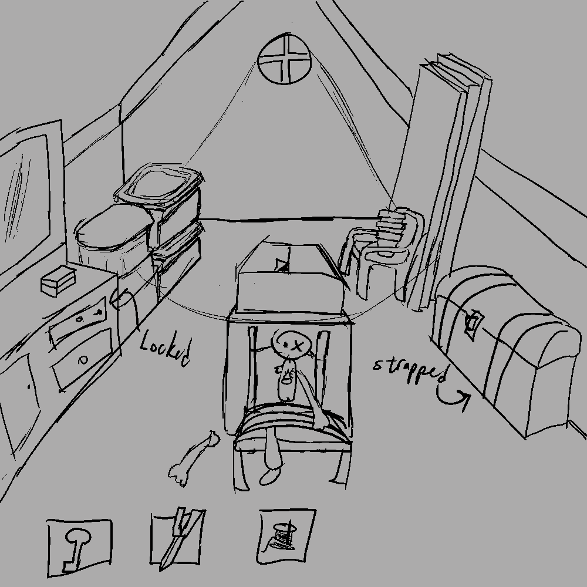
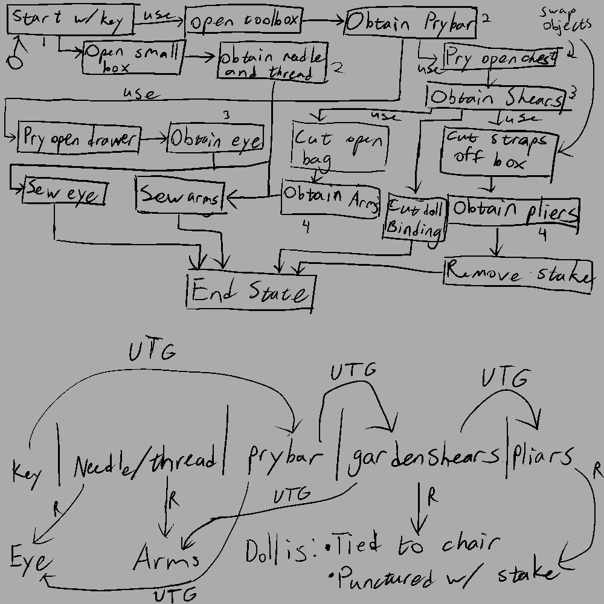

<h1>Ragdoll Revival</h1>

A game-jam game made for Godot Wild Jam #74

<h3>Summary</h3>

&emsp;You find yourself in an old, abandoned attic. There appears to be a doll present; beaten and broken. You feel compelled to repair it.

<h3>Where To Play?</h3>

&emsp;You can play this game directly in your browser either via the <a href=https://doctorsquawk.itch.io/ragdoll-revival>itch.io page</a> or here on <a href=https://jbevell.github.io/Ragdoll-Revival/>github pages</a>.

<h3>Game Controls</h3>

&emsp;This is a point-and-click style game controlled entirely with a mouse. Click on inventory items on the left side of the screen and use them to interact with elements in the game. You may click a selected inventory item again to deselect it.

<h3>Development Notes</h3>
<i>About the Jam</i>

&emsp;Godot Wild Jam #74 took place on October 11, 2024. The main theme was "Haunted", with three optional themes or design elements called "Wildcards". I opted to use the Wildcard "It's Broken - The player needs to repair and/or restore something". All participants had until October 20, 2024 to design, develop, test, and publish their submissions.

<i>Game Design Overview</i>

&emsp;It's Halloween! Or, close enough. As a fan of horror, I was excited to participate and play other participants' submissions for this jam. I had also been wanting to try my hand at a point-and-click style game, having just played the entire Myst series. Trying my hand at the basics seemed like a good idea during a jam. The idea for this one came quickly once I saw the Wildcards. What I ended up creating for the scene was essentially what I had seen in my head except for the doll's design. She was originally going to be much more ambiguous in style but I liked the idea of making a nod to the Sadako hair-over-the-face look.

&emsp;The room came together through trial and error, considering what could create plausible interactions for the player to figure out, a little bit of just making decisions and hoping that they worked, and an attempt to prevent the possible interactions from getting too large in scope. I ended up drawing a flow chart of the object interactions, specifically to ensure that I wouldn't accidentally create extra complexity.

&emsp;

